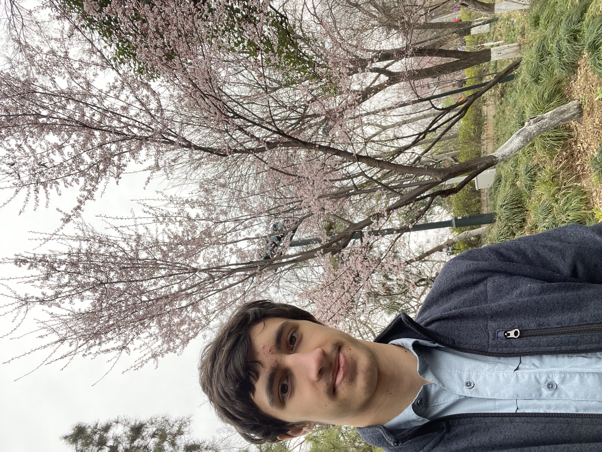

## About Me

Hi! I am currently a freshman student at Purdue University with an interest in Computer Engineering, Engineering applications in Chemistry, and adjacent fields.

## Research Interest

### In CE
- Field Programmable Gate Appliances (FPGAs)
- Robotics (especially control and verification algorithms)
- "Full-stack" robotics
- Wireless communication

### In Chemistry (former interests)
- Total Organic Synthesis
- Multi-factor Characterization using HPLC, NMR, FTIR, and Raman Spectroscopy.
- Retrosynthesis and Reaction Prediction Algorithms
- Organometalics

## Publications

### In Chemistry 

1. Jully Patel, N. P. Dileep, __Vladimir Bondar__, Priya Gopal, Anton V. Sinitskiy, Sergei Savikhin,
and Yulia Pushkar, “Unification of light absorption and catalytic capability in Fe-Triazolate
Metal-Organic Framework for artificial photosynthesis”, Submited to _Angewantde Chemie_
2. __Vladimir Bondar__, Bidhan Barua, and Lark Perez, “Synthesis of Novel Linkers for Ionizable
Nanoparticles”, Summer Undergraduate Poster Session, Rowan University, July 2024

### In CE

Working on it 😅.

<!-- ## Typography

This is a [link](http://google.com). Something *italics* and something **bold**.

Here is a table

Year | Award | Category
-----|-------|--------
2014 | Emmy  | Won Outstanding Lead Actor in a miniseries or a movie
2015 | BAFTA | Nominated for Best Leading Actor for Sherlock
2014 | Satellite | Won Best Actor miniseries or television film

Here is a horizontal rule

---

Here is a blockquote

> To a great mind, nothing is little -->

## Technical Skills

Area                  | Skills          
----------------------|----------------------
Programming Languages | Java, Python, R (most proficient)
Operating Systems     | __Linux__, Windows
Programs              | OriginLab, Office, Fusion 360 or Onshape
Tools                 | GNUtils, Git, Bash, Latex
Human Languages       | English, Russian (Native), Spanish (B2)

## References

* Prof. Yulia Pushkar, Associate Professor of the Physics and Astrophysics Department, Purdue University, West Lafayette, IN
* Prof. Lark Perez, Associate Professor & Chair of Chemistry Department, Rowan University, Glassboro, NJ
* Dov Gorman, Executive Director, South Jersey Innovation Center, Cherry Hill, NJ

## Misc
> Pray Babbage, FIXME

\- Charles Babbage, Fellow...
